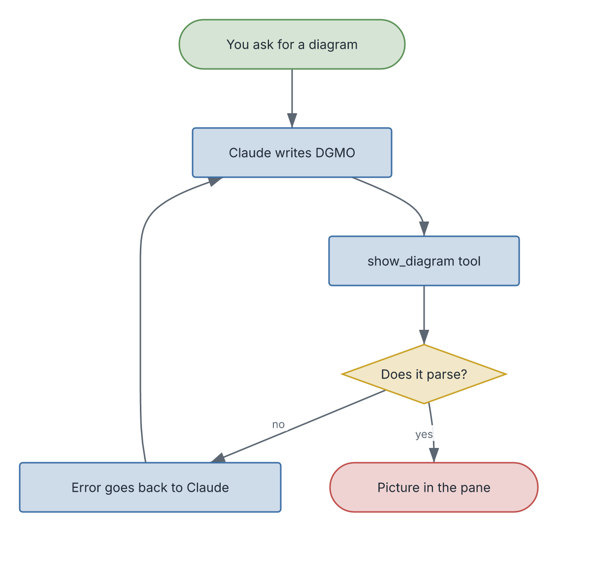

# dgmo-pane

**Ask Claude for a diagram and see it beside the conversation.**

A [Claude Code](https://claude.com/claude-code) mod that adds a live diagram pane.
Say "diagram the login flow" or "draw this directory structure", and Claude
writes the diagram in [DGMO](https://diagrammo.app) and the picture appears in a
side pane. When Claude gets the syntax wrong, the error goes back to Claude, which
fixes it and tries again.



<sub>That picture is itself a DGMO diagram: [`assets/how-it-works.dgmo`](assets/how-it-works.dgmo).</sub>

## Install

You need two things first:

1. **Claude Code 2.1.282 or later**: check with `claude --version`.
2. **The `dgmo` command**:

   ```sh
   npm install -g @diagrammo/dgmo-cli
   ```

Then, inside a Claude Code session in your terminal, run:

```
/plugin install dgmo-pane --marketplace diagrammo/dgmo-pane
```

If it asks to add the `diagrammo/dgmo-pane` marketplace, answer `y`. If it asks
for a scope, choose **user** to have the pane in every project.

**Restart Claude Code** (quit and run `claude` again). The `/dgmo-pane` command
and the `show_diagram` tool are then ready.

## Use it

| You do | What happens |
| --- | --- |
| Ask in plain words: "diagram how auth works here" | Claude draws it with `show_diagram`; the pane opens with the picture |
| `/dgmo-pane draw the release process` | The same thing, as a command |
| `/dgmo-pane docs/arch.dgmo` | Shows that `.dgmo` file |
| Claude writes or edits any `.dgmo` file | The pane redraws it after each save |
| `/dgmo-pane` | Opens the pane |

If a diagram does not parse, the pane keeps the last good picture and shows the
error in red above it.

**Where it draws:** in Ghostty and kitty the diagram is a real image, and that
works over ssh. The Claude desktop app and VS Code draw it as SVG. Other
terminals show a one-line description instead.

## Update

In a shell:

```sh
claude plugin marketplace update dgmo-pane
claude plugin update dgmo-pane@dgmo-pane
```

Then restart Claude Code.

## Uninstall

```sh
claude plugin uninstall dgmo-pane@dgmo-pane
claude plugin marketplace remove dgmo-pane
```

## Troubleshooting

| You see | Do this |
| --- | --- |
| `Unknown command: /dgmo-pane` right after installing | Restart Claude Code |
| `could not show it: …` or `dgmo exited …` in the pane | Install `dgmo`: `npm install -g @diagrammo/dgmo-cli`, then check that `dgmo --version` works in the same shell you start `claude` from |
| The pane does not open by itself | It waits until the terminal is at least 144 columns wide. Widen the window, or run `/dgmo-pane` to open it at any width |
| An empty box, or a one-line description where the picture should be | Your terminal cannot draw images. Use Ghostty or kitty, or the Claude desktop app |
| Claude keeps getting DGMO syntax wrong | Run `dgmo install claude-code`. It gives Claude the full DGMO language reference |

The mod API is early access, so a Claude Code update can change how mods work.
If the pane breaks after an update, please
[open an issue](https://github.com/diagrammo/dgmo-pane/issues) with your
`claude --version`.

## Develop

```sh
claude plugin validate .
claude plugin test .
claude --plugin-dir .      # run a session with this checkout loaded
```
